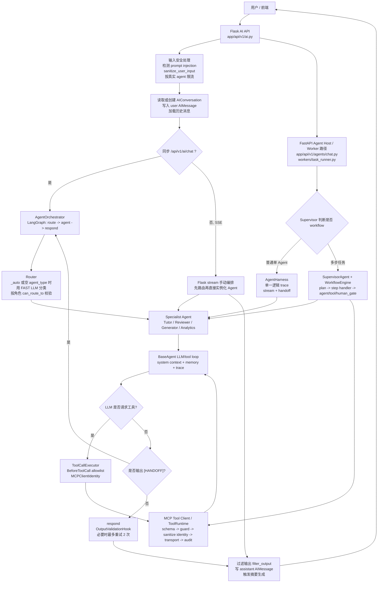

# Agent 运行时核心逻辑

最后更新：2026-06-03

本文按当前真实代码说明 CodeRunner-AI 的 Agent、Router、Orchestrator 如何协作。范围包括普通聊天、流式聊天、异步 worker 路径和多步 workflow 路径；判断运行事实时以代码为准，而不是旧计划文档。

## 代码入口

| 模块 | 当前职责 |
|---|---|
| `app/api/v1/ai.py` | Flask 主业务 API：同步聊天、流式聊天、异步任务、生成、分析、trace/eval 等入口 |
| `graph/runner.py` | 普通同步聊天的 Router + LangGraph Orchestrator |
| `agents/base.py` | 四个 specialist agent 的共享 LLM/tool loop、trace、handoff、失败处理 |
| `agents/{tutor,reviewer,generator,analytics}/agent.py` | 具体 Agent 的 system context、知识库预取和特定输出逻辑 |
| `core/definitions.py` | Agent 声明式定义：角色权限、工具白名单、输入字段、输出格式 |
| `agents/executor.py` | Agent 调 MCP 工具的客户端边界 |
| `tools/protocol/runtime.py` | ToolRuntime：工具目录、schema、权限 guard、审计、实际 transport 调用 |
| `knowledge/store.py` | Chroma 知识库：题目相似度、知识点、错误模式 |
| `evals/harness/agent_harness.py` | 异步 worker/eval 路径的一次逻辑 trace + handoff 编排 |
| `graph/supervisor.py` / `graph/engine.py` | 多步 workflow 的规划与执行编排 |

## 请求流转图

## 核心数据结构

### 输入

Agent 运行时统一围绕 `AgentState` 传递数据：

| 字段 | 含义 |
|---|---|
| `messages` | LangChain 消息列表，包含历史消息和当前用户消息 |
| `agent_type` | `tutor`、`reviewer`、`generator`、`analytics` 或入口阶段的 `auto` |
| `user_id` | 当前用户 ID，会进入工具调用身份 |
| `user_role` | `student`、`teacher`、`admin`、`agent_host` 等角色 |
| `context` | 业务上下文，例如 `conversation_id`、`question_id`、`submission_id`、`code`、`language`、`topic`、`difficulty`、`target_student_id`、`period` |
| `tool_results` | 工具结果占位；当前主要由消息流和 ToolMessage 承载 |
| `final_response` | Agent 最终文本或 JSON 字符串 |
| `trace_id` | 当前 agent run 或 harness trace 的 ID |
| `handoff_*` | handoff 目标、原因、摘要、来源和已处理 agent 列表 |

输入契约由 `agents/contracts.py` 做 warn-only 校验；它不阻断请求，只记录输入漂移。

### 输出

| 输出 | 说明 |
|---|---|
| `final_response` | 最终要返回给用户或保存到 assistant 消息的内容 |
| `messages` | 更新后的消息历史；system prompt 会在保存前剔除 |
| `trace_id` | trace 查询和 eval 回放可关联的运行 ID |
| `context.generated_problem` | generator 成功解析题目 JSON 后写入的生成题目 |
| `handoff_to` / `handoff_reason` | Agent 请求转交给其他 agent 时写入 |
| SSE event | 流式路径会输出 `start`、`route`、`token`、`tool_call`、`tool_result`、`handoff_start`、`replace`、`done`、`error` 等事件 |

## Router

### 职责

Router 的当前实现集中在 `graph/runner.py`：

- 把入口的 `auto` 或空 `agent_type` 解析为具体 agent。
- 用 `ModelTier.FAST` 的 LLM 做意图分类。
- 从 `core/definitions.py` 读取 agent 描述和合法 agent 名称。
- 用 `can_route_to(agent_name, user_role)` 做角色访问校验。
- 在分类失败、空消息或非法 agent 时回退到默认 agent。

Flask 普通聊天入口目前通过 `_normalize_chat_agent_type()` 强制从 `auto` 开始，因此用户侧显式指定的聊天 agent 不直接作为最终路由结果；API 层会先用 `_resolve_and_rate_limit()` 分类出真实 agent 并按真实 agent 限流。

### 输入

- `messages[-1].content`：当前用户消息。
- `agent_type`：可能是 `auto`、空值或已指定的 agent。
- `user_role`：用于默认回退和角色授权。

### 输出

- `state["agent_type"]`：最终 agent。
- `state["auto_routed"] = True`：当经过自动路由时写入。

### 失败处理方式

- 没有用户消息：学生默认 `tutor`，非学生默认 `analytics`。
- LLM 分类失败：记录 warning，同样按角色默认回退。
- LLM 输出非法 agent：按角色默认回退。
- 角色无权访问目标 agent：按角色默认回退；例如 student 不能进入 generator。

## Orchestrator

当前项目不是单一 Orchestrator，而是按运行入口分成四类编排。

### 1. 同步聊天：`AgentOrchestrator`

位置：`graph/runner.py`

职责：

- 构建 LangGraph：`route -> concrete agent -> respond`。
- route 后按 `agent_type` 进入具体 agent 节点。
- agent 执行后检查 handoff。
- respond 阶段通过 `OutputValidationHook` 校验 JSON schema；失败时追加修复消息并最多重试 2 次。

输入：

- 完整 `AgentState`。

输出：

- 更新后的 `AgentState`，由 Flask API 做 `filter_output()`、保存 assistant 消息、返回 JSON。

失败处理：

- `_run_agent()` 捕获 `AIError`，返回 `e.user_message`。
- 其他异常返回 `"An unexpected error occurred. Please try again later."`。
- schema 校验连续失败后不再无限循环，而是在响应前追加 warning。
- handoff 最多 2 次，并阻止回到已处理过的 agent。

### 2. Flask SSE 流式聊天：手动编排

位置：`app/api/v1/ai.py`

职责：

- API 层先完成安全处理、路由和限流。
- 根据 `_AGENT_MAP` 直接实例化目标 agent。
- 逐个转发 agent stream event。
- 手动处理 handoff chain。
- 汇总 `full_response` 后过滤输出、保存 assistant 消息、发送 `done`。

输入：

- 用户消息、历史消息、上下文、已路由 agent。

输出：

- SSE event stream。
- assistant `AIMessage`。
- generator 场景下可能解析并附带 `question_data`。

失败处理：

- 初始化 conversation 失败会返回 500。
- agent stream 内部会产出 `error` 事件或由外层异常处理返回错误事件。
- heartbeat 防止长连接无输出。
- handoff 有最大次数和重复目标限制。

### 3. 异步 worker / eval：`AgentHarness`

位置：`evals/harness/agent_harness.py`，由 `workers/task_runner.py` 使用。

职责：

- 为一个 chat task 或 eval case 创建单一逻辑 trace。
- 在 ambient trace 中运行初始 agent 和 handoff chain。
- 结束时只保存一次聚合 trace。
- 输出 `done` 事件，包含 `trace_id`、最终 agent、状态和响应。

输入：

- `agent_type`、`message`、`user_id`、`user_role`、`context`、`history`、`budget`。

输出：

- 流式 event。
- `AgentResult` 或 worker 聚合后的 assistant message。

失败处理：

- 如果 `stream()` 没有发出 `done`，`run()` 抛出 `RuntimeError`。
- agent 内部失败会写入 trace pending status/error，最终由 harness 保存。
- worker 外层捕获异常并把 `ChatTask` 标为 `failed`，同时向 Redis buffer 推送 `error`。

### 4. 多步 workflow：`SupervisorAgent` + `WorkflowEngine`

位置：`graph/supervisor.py`、`graph/engine.py`、`graph/node_registry.py`

职责：

- `SupervisorAgent` 判断是否需要 workflow，生成 plan，并交给 `WorkflowEngine`。
- `WorkflowEngine` 按 step 执行，支持 `agent_call`、`tool_call`、`validation`、`llm_call`、`human_gate`。
- 每个 step 持久化为 `WorkflowStep`，整体持久化为 `WorkflowRun`。

输入：

- 用户 goal、角色、上下文、可选预定义 steps。

输出：

- workflow 状态、step 输出、SSE workflow events、最终 result。

失败处理：

- 空 plan 直接 failed。
- 超过最大 step 数会截断到 `MAX_WORKFLOW_STEPS`。
- 超时后 workflow failed。
- step handler 缺失、step 返回失败、critic 拒绝且重试耗尽，都会使 workflow failed。
- `human_gate` 会暂停到 `waiting_approval`，审批拒绝则 cancelled。

## Agent

### 共享运行逻辑

四个 specialist agent 都继承 `BaseAgent`，共享以下逻辑：

- 拼接 `SystemMessage(system_ctx)` 和用户/历史消息。
- 对长对话调用 `MemoryService.compact_messages(messages, max_messages=20)`。
- 通过 `AIConfig.get_llm(tier=...)` 获取模型。
- 只把当前 agent 允许的工具 schema bind 给 LLM。
- 循环处理 LLM 响应和 tool calls，最多 `MAX_TOOL_ITERATIONS = 5`。
- 整个 trace 最多 `MAX_LLM_CALLS_PER_TRACE = 12` 次 LLM 调用。
- 兼容旧式 `<function>...</function>` 文本工具调用，并只在工具位于白名单时转换。
- 每次工具调用都通过 `ToolCallExecutor` 跨 MCP client 边界。
- system prompt 不写回持久化 conversation history。
- 输出后检测 `[HANDOFF: agent_type | reason]`。

### 工具调用边界

Agent 不能直接 import 工具实现。真实链路是：

1. Agent 只拿到 `core/definitions.py` 中声明的 `allowed_tools`。
2. `BaseAgent` 根据工具目录构造 LLM tool schema。
3. LLM 返回 tool call。
4. `ToolCallExecutor` 触发 `BeforeToolCall` hook，阻止白名单外工具。
5. 构造 `MCPClientIdentity`，带上 `user_id`、`role`、`agent_type`、`task_id`、`conversation_id`、`trace_id`。
6. `mcp_gateway.client` 调用 MCP 工具客户端。
7. 最终进入 ToolRuntime 时会做 input schema 校验、RBAC/scope/risk guard、身份参数覆盖、transport 调用和 audit。

### Agent 明细

| Agent | 职责 | 输入 | 输出 | 可调用工具 | 可访问知识库 | 典型使用场景 | 失败处理方式 |
|---|---|---|---|---|---|---|---|
| `tutor` | 用苏格拉底式引导帮助学生调试和理解题目，不直接给完整答案 | `question_id`、`submission_id`、`code`、`error_status`、`topic`、当前用户 ID/角色、历史消息 | 自然语言辅导回复，可请求 handoff | `coderunner.code.execute`、`coderunner.problem.get_detail`、`coderunner.submission.list_for_student`、`coderunner.submission.get_detail`、`coderunner.knowledge.search`、`coderunner.knowledge.search_error_patterns` | 直接预取 `search_error_patterns()` 和 `search_knowledge()`；工具层也允许知识搜索 | 学生问“为什么 WA/RE/TLE”、需要提示、需要结合提交记录和题目要求解释 | 知识库初始化失败时跳过 RAG；LLM/tool loop 失败走 BaseAgent trace failed；工具越权被 hook/MCP guard 拦截；超出 tool loop 返回 explicit limit error |
| `reviewer` | 审查代码正确性、可读性、效率、安全和最佳实践，输出结构化 JSON | `question_id`、`code`、`language` | reviewer JSON，包含评分、summary、issues、strengths 等 | `coderunner.code.execute`、`coderunner.problem.get_detail` | 无直接知识库预取；工具白名单也不包含知识库搜索 | 学生/教师要求代码 review，或 tutoring handoff 到 reviewer | JSON 输出由 OutputValidationHook 校验；schema 失败时 Orchestrator 最多重试 2 次；工具调用错误会作为 ToolMessage 反馈给 LLM |
| `generator` | 教师/管理员生成新题、测试用例和参考解，并做自验证 | `topic`、`difficulty`、`language`、`test_case_count`、`prompt`、`quiz_id` | 包装为 `{"question": ...}` 的题目 JSON；写入 `context.generated_problem`；标记 `verified` | `coderunner.code.execute_internal`、`coderunner.knowledge.search_similar_problems`、`coderunner.problem.save_generated` | 直接预取 `search_similar_problems()` 避免重复；工具层也允许相似题搜索 | 教师出题、批量生成、根据薄弱知识点生成题目 | 最多 `MAX_VALIDATION_ROUNDS = 3` 轮 JSON/参考解修复；解析失败会要求重输 JSON；缺少 solution/test_cases 会重试；参考解验证失败会反馈失败用例；最终仍失败则 `verified=False` 或返回当前响应 |
| `analytics` | 分析学生学习数据、错误模式、进度趋势和班级统计 | `target_student_id`、`question_id`、`period`、当前用户 ID/角色 | analytics JSON 报告 | `coderunner.problem.get_detail`、`coderunner.submission.list_for_student`、`coderunner.submission.get_detail`、`coderunner.analytics.student_stats`、`coderunner.analytics.student_activity`、`coderunner.analytics.class_statistics`、`coderunner.analytics.problem_difficulty` | 不直接访问 Chroma；会注入 `MemoryService.get_memory_context()` 的用户画像/近期摘要 | 教师看班级或学生表现，学生看个人学习进展，trace/eval 需要分析报告 | JSON 输出由 OutputValidationHook 校验；旧式 `<function>` 工具文本会被转换成真实工具调用，避免流式泄漏；工具失败进入 ToolMessage 或错误 envelope |

## Knowledge Base 访问边界

当前知识库由 `knowledge/store.py` 管理，底层是 Chroma：

| Collection | 用途 | 当前访问者 |
|---|---|---|
| `questions` | 相似题检索、去重参考 | `GeneratorAgent._get_similar_problems()`，以及 `coderunner.knowledge.search_similar_problems` |
| `knowledge_points` | 课程知识点检索 | `TutorAgent._get_kb_context()`，以及 `coderunner.knowledge.search` |
| `error_patterns` | 常见错误模式检索 | `TutorAgent._get_kb_context()`，以及 `coderunner.knowledge.search_error_patterns` |

知识库异常处理是降级式：agent 直接预取时捕获异常并返回空上下文；`kb_health()` 也以 `degraded` 表示非致命状态。也就是说 RAG 缺失不应阻断普通 agent 回复，但会降低上下文质量。

## 失败处理总览

| 层级 | 失败类型 | 当前处理 |
|---|---|---|
| API 输入层 | 空消息 | 返回 400 |
| API 输入层 | prompt injection 命中 | 记录审计，并对输入 sanitize；不直接阻断 |
| API 限流层 | Redis 可用且超限 | 返回 429 |
| API 限流层 | Redis 失败 | 当前 fail-open，记录 warning 后放行 |
| Router | 分类失败、非法 agent、无权访问 | 按角色回退到默认 agent |
| Agent loop | LLM 临时错误 | `_llm_invoke` / `_llm_stream` 带 retry；首轮失败可能向上抛出或流式 error |
| Agent loop | tool loop 超限 | 返回 `AgentExecutionLimitError.user_message`，trace 标为 `limit_exceeded` |
| Agent loop | trace 级 LLM 调用预算耗尽 | 终止 loop，按 limit exceeded 处理 |
| Tool 边界 | 工具不在 agent 白名单 | `ToolAllowlistHook` 阻断，返回 `TOOL_NOT_ALLOWED` ToolMessage |
| ToolRuntime | 参数 schema 错误、权限/risk guard 拒绝、工具不存在 | 返回 MCP error envelope；approval required 会返回 `approval_id` |
| Output validation | JSON schema 不通过 | Graph respond 最多重试 2 次；耗尽后带 warning 返回 |
| Handoff | 目标非法、自己转自己、角色无权、重复目标、超过次数 | 阻止 handoff，直接 respond |
| Knowledge Base | Chroma/embedding 初始化失败或 collection 为空 | 直接预取路径返回空上下文；健康检查为 degraded |
| Worker | 后台 chat task 异常 | `ChatTask.status=failed`，Redis 推送 `error` |
| Workflow | 超时、step handler 缺失、step 重试耗尽、human gate 拒绝 | workflow failed / cancelled / waiting_approval |

## 当前边界判断

1. **Router 是 agent 选择器，不是业务执行器。** 它只修改 `state.agent_type`，不调用工具、不访问知识库、不保存消息。
2. **Orchestrator 是执行图或执行链控制器。** 同步路径使用 LangGraph，流式路径使用手动循环，异步 worker/eval 使用 AgentHarness，多步任务使用 Supervisor + WorkflowEngine。
3. **Agent 是业务推理单元。** 每个 agent 负责构造自己的 system context、声明模型 tier、选择是否预取知识库，并通过共享 BaseAgent 调 LLM/工具。
4. **工具调用是 MCP 边界。** Agent 不直接执行工具；工具执行经过 allowlist、MCP identity、ToolRuntime guard、schema、audit。
5. **知识库不是所有 agent 的通用上下文。** 当前只有 tutor 和 generator 直接预取 Chroma 内容；reviewer 不访问知识库，analytics 主要通过业务统计工具和 memory context。
6. **同步与流式路径并不完全相同。** 同步聊天进入 `AgentOrchestrator`；Flask SSE 手动编排；worker/eval 使用 `AgentHarness` 统一 trace。后续如要收敛复杂度，应优先考虑统一这些编排路径。
