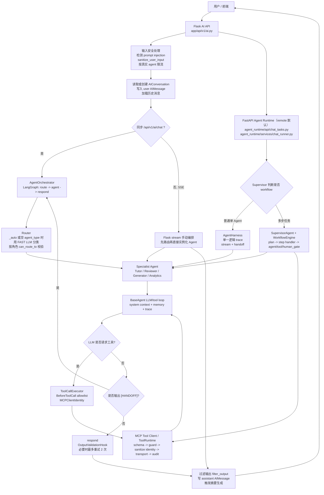

# 2026-06-07 · CodeRunner-AI 架构 02｜AI Agent 平台

> 文档编号 02 ｜ 最后更新 2026-06-07 ｜ 范围: Agent 设计、运行时核心流程、Router/Orchestrator、工具与记忆集成、数据模型、API 与配置

本文档描述 CodeRunner-AI 的 AI Agent 模块设计与运行时实现现状：在评测平台之上集成多 Agent 编排系统，为学生和教师提供智能辅导、代码审查、自动出题和学习分析能力。全文分两部分——先用「运行时核心流程速览」给出请求如何在 Router / Orchestrator / Agent / 工具之间流转的快速地图，其后是各能力的详细设计。

### 项目定位

```
面向在线编程教学场景的内部多 Agent 智能辅助系统
+ 外部 LLM Provider（DeepSeek API）
+ 标准化工具接入层（MCP，已成为唯一工具边界）
```

**重要术语约定**：
- **Agent** = 项目内部定义的教学任务执行单元（Tutor / Reviewer / Generator / Analytics）
- **LLM Provider** = 外部模型服务（DeepSeek）。DeepSeek 不是 Agent，是底层推理引擎
- **MCP** = 工具协议层。Phase E 完成后已成为 Agent 的唯一工具边界

### 当前实现 vs 目标架构

| 能力 | 当前状态 | 目标状态 |
|------|---------|---------|
| 内部业务 Agent | ✅ Tutor / Reviewer / Generator / Analytics | 不变 |
| 声明式 Agent 定义 | ✅ `definitions.py` — name, tools, roles, tier, risk | 不变 |
| Model Router | ✅ 三层 tier (fast/balanced/strong)，DeepSeek provider | 多 provider 支持 |
| Orchestrator | ✅ LangGraph StateGraph，基于 definition 路由 | Education Orchestrator 多步编排 |
| 工具调用 | ✅ 内部 Agent 经 MCP client 跨 transport 调用 gateway（ToolRuntime 仅为服务端引擎） | 不变 |
| MCP 内核 | ✅ `mcp_gateway` FastMCP 服务 + `tools/protocol` guard pipeline，唯一工具边界 | 不变 |
| Human Gate | ⚠️ 生成草稿审批流 | 与 AgentTask 状态机完整打通 |
| Subagent 隔离 | ❌ Agent 共享上下文 | 独立上下文窗口和工具权限 |
| 多模型路由 | ✅ tier 抽象，单 provider | 多 provider + 动态路由策略 |
| Observability | ✅ runtime-neutral trace/eval（`agent_trace_*` / `eval_*`）+ Harness 单 trace + Report/Regression | 统一 trace/audit/approval 关联 |

---

## 〇、运行时核心流程速览（Runtime Core）

> 本节是运行时的快速地图，按当前真实代码描述请求如何在 Router / Orchestrator / Agent / Tool 之间流转；逐项细节见后文「五、Orchestrator 编排流程」「六、四个 Agent 详细设计」「七、BaseAgent 统一管道」「八、Tool 层设计」。

### 代码入口

| 模块 | 当前职责 |
|---|---|
| `app/api/v1/ai.py` | Flask 主业务 API：同步聊天、流式聊天、异步任务创建/读取、生成、分析、trace/eval 等入口 |
| `graph/runner.py` | 普通同步聊天的 Router + LangGraph Orchestrator |
| `agents/base.py` | 四个 specialist agent 的共享 LLM/tool loop、trace、handoff、失败处理 |
| `agents/{tutor,reviewer,generator,analytics}/agent.py` | 具体 Agent 的 system context、知识库预取和特定输出逻辑 |
| `core/definitions.py` | Agent 声明式定义：角色权限、工具白名单、输入字段、输出格式 |
| `agents/executor.py` | Agent 调 MCP 工具的客户端边界 |
| `tools/protocol/runtime.py` | ToolRuntime：工具目录、schema、权限 guard、审计、实际 transport 调用 |
| `knowledge/store.py` | Chroma 知识库：题目相似度、知识点、错误模式 |
| `evals/harness/agent_harness.py` | remote/eval 路径的一次逻辑 trace + handoff 编排 |
| `agent_runtime/` | FastAPI Agent Runtime：`AGENT_RUNTIME_MODE=remote`(默认)下的 chat/workflow 执行边界 |
| `graph/supervisor.py` / `graph/engine.py` | 多步 workflow 的规划与执行编排 |

### 请求流转图



### AgentState（运行时统一载体）

Agent 运行时围绕 `AgentState` 传递数据：`messages`、`agent_type`、`user_id`、`user_role`、`context`（`conversation_id`/`question_id`/`submission_id`/`code`/`language`/`topic`/`difficulty`/`target_student_id`/`period` 等）、`tool_results`、`final_response`、`trace_id`、`handoff_*`。输入契约由 `agents/contracts.py` 做 warn-only 校验（只记录漂移，不阻断）。流式路径输出 `start`/`route`/`token`/`tool_call`/`tool_result`/`handoff_start`/`replace`/`done`/`error` 等 SSE event。

### 失败处理总览

| 层级 | 失败类型 | 当前处理 |
|---|---|---|
| API 输入层 | 空消息 | 返回 400 |
| API 输入层 | prompt injection 命中 | 记录审计，并对输入 sanitize；不直接阻断 |
| API 限流层 | Redis 可用且超限 | 返回 429 |
| API 限流层 | Redis 失败 | 当前 fail-open，记录 warning 后放行 |
| Router | 分类失败、非法 agent、无权访问 | 按角色回退到默认 agent |
| Agent loop | LLM 临时错误 | `_llm_invoke` / `_llm_stream` 带 retry；首轮失败可能向上抛出或流式 error |
| Agent loop | tool loop 超限 | 返回 `AgentExecutionLimitError.user_message`，trace 标为 `limit_exceeded` |
| Agent loop | trace 级 LLM 调用预算耗尽 | 终止 loop，按 limit exceeded 处理 |
| Tool 边界 | 工具不在 agent 白名单 | `ToolAllowlistHook` 阻断，返回 `TOOL_NOT_ALLOWED` ToolMessage |
| ToolRuntime | 参数 schema 错误、权限/risk guard 拒绝、工具不存在 | 返回 MCP error envelope；approval required 会返回 `approval_id` |
| Output validation | JSON schema 不通过 | Graph respond 最多重试 2 次；耗尽后带 warning 返回 |
| Handoff | 目标非法、自己转自己、角色无权、重复目标、超过次数 | 阻止 handoff，直接 respond |
| Knowledge Base | Chroma/embedding 初始化失败或 collection 为空 | 直接预取路径返回空上下文；健康检查为 degraded |
| Remote 执行 | FastAPI Runtime chat task 异常 | `ChatTask.status=failed`，Redis 推送 `error` |
| Workflow | 超时、step handler 缺失、step 重试耗尽、human gate 拒绝 | workflow failed / cancelled / waiting_approval |

### 运行时边界判断

1. **Router 是 agent 选择器，不是业务执行器。** 它只修改 `state.agent_type`，不调用工具、不访问知识库、不保存消息。
2. **Orchestrator 是执行图或执行链控制器。** 同步路径使用 LangGraph，流式路径使用手动循环，remote/eval 使用 AgentHarness，多步任务使用 Supervisor + WorkflowEngine。
3. **Agent 是业务推理单元。** 每个 agent 负责构造自己的 system context、声明模型 tier、选择是否预取知识库，并通过共享 BaseAgent 调 LLM/工具。
4. **工具调用是 MCP 边界。** Agent 不直接执行工具；工具执行经过 allowlist、MCP identity、ToolRuntime guard、schema、audit。
5. **知识库不是所有 agent 的通用上下文。** 当前只有 tutor 和 generator 直接预取 Chroma 内容；reviewer 不访问知识库，analytics 主要通过业务统计工具和 memory context。
6. **同步与流式路径并不完全相同。** 同步聊天进入 `AgentOrchestrator`；Flask SSE 手动编排；remote/eval 使用 `AgentHarness` 统一 trace。后续如要收敛复杂度，应优先统一这些编排路径。

---

## 一、架构概览

```
┌──────────────────────────────────────────────────────────┐
│                   Flask Web App                          │
│  /api/v1/ai/*  端点                                      │
└────────────────────┬─────────────────────────────────────┘
                     │
    ┌────────────────▼────────────────────┐
    │        安全层 (security.py)          │
    │  注入检测 · 输入消毒 · 动态安全警告    │
    │  限流 (Redis) · 审计日志              │
    └────────────────┬────────────────────┘
                     │
         ┌───────────▼────────────────────┐
         │  AgentOrchestrator              │
         │  (LangGraph StateGraph)         │
         │                                │
         │  route → agent → respond        │
         │  意图分类(FAST) · Schema 校验    │
         │  Handoff 检测 · 角色权限         │
         │                                │
         │  ◆ 基于 AgentDefinition 路由     │
         └──┬──────┬──────┬──────┬────────┘
            │      │      │      │
     ┌──────▼┐ ┌──▼───┐ ┌▼────────┐ ┌──────────┐
     │ Tutor │ │Review│ │Generator│ │Analytics │
     │BALANCED│ │BALANCED│ │STRONG │ │STRONG    │
     └──┬────┘ └──┬───┘ └──┬──────┘ └──┬───────┘
        │         │        │           │
     ┌──▼─────────▼────────▼───────────▼──┐
     │        BaseAgent 管道               │
     │  _invoke_with_tools (同步)          │
     │  _stream_with_tools (SSE)           │
     │  TraceCollector · 消息压缩           │
     │  权限检查 · 安全参数注入             │
     └──────────────┬─────────────────────┘
                    │
     ┌──────────────▼─────────────────────┐
     │        Model Router                 │
     │  ModelTier: fast/balanced/strong    │
     │  Provider: DeepSeek (当前唯一)       │
     └──────────────┬─────────────────────┘
                    │
     ┌──────────────▼─────────────────────┐
     │      MCP 工具边界（唯一）             │
     │ MCPToolClient → MCP transport →      │
     │ mcp_gateway → ToolRuntime guard      │
     │ (RBAC · scope · risk · audit · schema)│
     │ → LocalTransport handler             │
     │ 详见 tools-mcp-rag.md §3.3           │
     └──────────────┬─────────────────────┘
                    │
     ┌──────────────▼─────────────────────┐
     │     现有 Service 层（不改动）         │
     │  executor_service · question_service│
     │  submission_service · teacher_stats │
     └────────────────────────────────────┘
```

### 关键设计原则

1. **Agent 不直接访问数据库**，一律通过现有 Service 层的 Tool 封装
2. **LangGraph 管理状态流转**，每个 Agent 是图中的一个节点
3. **对话历史持久化到数据库**，运行时状态缓存到 Redis
4. **SSE 流式输出**，兼容现有 Jinja2 前端
5. **Orchestrator 统一入口**，前端可指定 agent_type 或由 LLM 自动路由
6. **Graceful Degradation**，所有新功能失败时不影响现有聊天能力

---

## 二、技术选型

| 组件 | 技术 | 用途 |
|------|------|------|
| LLM Provider | DeepSeek API (deepseek-chat)，兼容 OpenAI 协议 | 外部 LLM Provider，非 Agent |
| Model Router | `models/` | 按 tier (fast/balanced/strong) 路由到 provider |
| Agent 编排 | LangGraph | 状态图驱动的多 Agent 流转 |
| LLM 集成 | langchain-openai + langchain-core | Tool Calling 标准抽象（通过 OpenAI 兼容接口） |
| 向量数据库 | ChromaDB | 知识库语义搜索 (RAG) |
| 嵌入模型 | sentence-transformers (all-MiniLM-L6-v2) | 文本向量化 |
| 状态缓存 | Redis 7 | 对话上下文缓存、rate limiting |
| 对话存储 | SQLite/MySQL (现有) | 对话历史持久化 |
| 流式输出 | Flask SSE (stream_with_context) | 实时响应 |

### 依赖

```
langgraph>=0.4.0
langchain-openai>=0.3.0
langchain-core>=0.3.0
redis>=5.0.0
chromadb>=0.4.0
sentence-transformers>=2.2.0
```

---

## 三、目录结构

Phase 6 重构后，agent 子系统拆分为多个顶层目录（每个目录单一职责，独立可替换）：

```
agents/                          # 角色定义层（每个 agent 一个子包）
├── __init__.py                  # 统一导出 BaseAgent / TutorAgent / ...
├── base.py                      # BaseAgent 抽象基类
├── config.py                    # AGENT_RATE_LIMITS 等共享配置
├── tutor/
│   ├── agent.py                 # TutorAgent — 智能辅导 (BALANCED)
│   └── prompt.py
├── reviewer/                    # ReviewerAgent — 代码审查 (BALANCED)
├── generator/                   # GeneratorAgent — 自动出题 (STRONG)
└── analytics/                   # AnalyticsAgent — 学习分析 (STRONG)

graph/                           # LangGraph 编排引擎
├── engine.py                    # WorkflowEngine
├── runner.py                    # AgentOrchestrator（前身为 orchestrator.py）
├── planner.py                   # 任务规划
├── supervisor.py                # 路由分派
├── critic.py                    # 质量审查
├── handoff.py                   # Agent 间交接
├── recovery.py                  # 孤儿任务恢复
├── handlers.py                  # 步骤处理器注册
├── state.py                     # WorkflowState
└── node_registry.py             # 节点注册中心

memory/                          # 会话记忆
├── service.py                   # MemoryService（消息压缩、摘要、画像更新）
└── preference.py                # 教师偏好自动学习

knowledge/                       # RAG 向量库
├── __init__.py                  # 导出 KnowledgeBase / get_knowledge_base / index_*
└── store.py                     # ChromaDB 客户端 + SentenceTransformer 嵌入

models/                          # LLM Router 与 Providers
├── __init__.py                  # 导出 ModelTier / ModelRouter / get_model_router
├── router.py                    # ModelRouter — tier → LLM 实例解析
├── tiers.py                     # ModelTier 枚举 (FAST / BALANCED / STRONG)
└── providers/
    ├── base.py                  # BaseProvider 抽象接口
    └── deepseek.py              # DeepSeekProvider

tools/                           # 工具实现（业务层）+ 协议层
├── code/executor.py             # execute_code_impl — 沙箱执行
├── problems/                    # get_problem_detail_impl / save_generated_problem_impl
├── analytics/queries.py         # 统计查询
├── students/summary.py          # 学生画像
├── traces/queries.py            # agent trace 查询
├── knowledge_search/search.py   # 知识库搜索
└── protocol/                    # 工具协议层（替代旧 mcp/）
    ├── registry.py              # ToolRegistry
    ├── runtime.py               # ToolRuntime + get_tool_runtime
    ├── errors.py                # MCPError 体系
    ├── schemas/                 # ToolDescriptor / TOOL_CATALOG
    ├── policies/                # rbac / risk / scopes / guard
    ├── adapters/                # llm_to_tool / tool_to_llm / result_to_message
    └── transports/              # inproc.py（进程内）

mcp_gateway/                     # MCP 服务 + 内部 Agent 的 MCP client（python -m mcp_gateway）
├── __main__.py                  # 入口（per-request 鉴权，启动 key 仅 dev 模式）
├── server.py                    # FastMCP 装配 + EXPECTED_TOOL_COUNT 断言
├── bootstrap.py                 # ToolRuntime 初始化（含 approval 处理器）
├── client.py                    # MCPToolClient — 内部 Agent 的工具调用适配器
├── tool_map.py                  # EXTERNAL_TOOL_MAP — 外部名↔canonical 名唯一映射
├── scopes.py                    # normalize_scopes — 旧 scope 归一化
├── _codegen.py / generated_tools.py  # 从 TOOL_CATALOG 生成的 FastMCP 包装
└── middleware/                  # auth / rate_limit / sanitizer / core(caller ctx)

workers/                         # 守护进程
├── __main__.py                  # FastAPI 入口（python -m workers）
├── chat.py                      # 流式聊天 worker
├── batch.py                     # 批量任务 runner
├── generation_pipeline.py       # 多阶段题目生成管线
├── task_runner.py               # ThreadPool 任务执行器
└── redis_buffer.py              # 任务缓冲队列

core/                            # 平台基建（共享给所有上层）
├── config.py                    # 统一 Settings
├── db/session.py                # SQLAlchemy session 工厂
├── db/models/                   # ORM 模型（含 mcp_api_key / mcp_audit_log / agent_run 等）
├── auth/                        # caller / context / tokens
├── observability/               # tracing.py + audit.py
├── definitions.py               # ★ 声明式 Agent 定义（取代旧 app/agents/definitions.py）
├── exceptions.py                # AIError / LLMError / ToolError / ...
├── security.py                  # 注入检测 / 输入消毒 / 输出过滤
├── schemas.py                   # Agent 输出 JSON Schema
├── state.py / task_state.py     # 共享状态类型与常量
```

> Flask 蓝图位于 `app/api/v1/agents/{chat,traces,workflows}.py`，URL 前缀保持不变。

---

## 三-B、Model Router（Phase B）

Agent 不再直接绑定 DeepSeek 的具体配置。所有 LLM 调用经过 `ModelRouter` 按 tier 解析：

| Tier | 用途 | 默认参数 |
|------|------|---------|
| `FAST` | 意图分类、消息压缩、对话摘要 | temperature=0.3, max_tokens=1024 |
| `BALANCED` | 日常辅导 (Tutor)、代码 Review | temperature=0.7, max_tokens=2048 |
| `STRONG` | 题目生成 (Generator)、综合分析 (Analytics) | temperature=0.5, max_tokens=4096 |

**调用方式**：
```python
from models import ModelTier, get_model_router
llm = get_model_router().get_llm(ModelTier.STRONG)
# 或通过 AIConfig 兼容入口：
llm = AIConfig.get_llm(tier=ModelTier.FAST)
```

当前只有 DeepSeek 一个 provider。接口设计支持未来添加其他 provider（如 OpenAI、Anthropic）而不需要修改 Agent 代码。

---

## 三-C、声明式 Agent 定义（Phase C）

每个 Agent 在 `core/definitions.py` 中声明完整定义，取代以前分散在类属性、权限表和编排器中的信息：

```python
AgentDefinition(
    name="tutor",
    description="Guide students through coding problems using Socratic method...",
    default_model_tier=ModelTier.BALANCED,
    allowed_roles=frozenset({"student", "teacher", "admin"}),
    allowed_tools=("execute_code", "get_problem_detail", ...),
    risk_level="low",
    input_fields=("question_id", "submission_id", "code", ...),
    output_format="free_text",
)
```

**Orchestrator 基于 definition 做**：
- 角色权限路由（`can_route_to(agent_name, user_role)`）
- 意图分类 prompt 自动生成（从 description 字段）
- Schema 校验跳过判断（`output_format == "free_text"` 则不校验）
- Handoff 权限检查

**权限系统基于 definition 做**：
- `check_tool_permission()` 先查 role override 表，再查 definition 的 `allowed_tools` + `allowed_roles`
- 新增 Agent 只需在 `definitions.py` 添加一条，不需要修改多处权限表

---

## 四、共享状态

```python
# core/state.py
class AgentState(TypedDict):
    messages: Annotated[list, add_messages]   # LangGraph 消息累加
    agent_type: Literal["tutor", "reviewer", "generator", "analytics"]
    user_id: int
    user_role: str                            # student / teacher / admin
    context: dict                             # 请求上下文（见下表）
    tool_results: list
    final_response: str
    validation_passed: bool                   # schema 校验结果
    attempt: int                              # 当前重试轮次
    task_id: str                              # 关联的 AgentTask ID
    trace_id: str                             # TraceCollector run_id
    parsed_output: dict                       # LLM 输出解析结果
    previous_agents: list                     # handoff 历史
    auto_routed: bool                         # 是否经过 LLM 自动路由
    handoff_to: str                           # handoff 目标 agent
    handoff_reason: str                       # handoff 原因
```

### context 字段说明

| 场景 | context 包含 |
|------|-------------|
| Tutor 辅导 | `question_id`, `submission_id`, `code`, `error_status`, `language` |
| Code Review | `question_id`, `code`, `language` |
| 自动出题 | `topic`, `difficulty`, `language`, `quiz_id`(可选), `test_case_count`, `prompt` |
| 学习分析 | `target_student_id`, `question_id`(可选), `period` |
| 通用 | `conversation_id`(内部设置) |

---

## 五、Orchestrator 编排流程

```
            ┌───────┐
            │ route │  意图识别 / 直接使用前端指定的 agent_type
            └───┬───┘
      ┌─────┬───┴───┬──────┐
      ▼     ▼       ▼      ▼
   tutor reviewer generator analytics
      │     │       │      │
      └─────┴───┬───┴──────┘
                ▼
           ┌─────────┐
           │ respond  │  Schema 校验 + Handoff 检测
           └────┬────┘
                │
         ┌──────┴──────┐
     校验失败 &&       校验通过 /
     attempt < 2       tutor 类型
         │                │
    重新执行 agent         ▼
                        END
```

### 路由规则

1. 前端在请求中指定 `agent_type` → 直接路由
2. `agent_type` 为 `"auto"` 或空 → `route` 节点用 LLM 做 few-shot 意图分类
3. `/chat/stream` 和 `/chat` 端点均支持自动路由

### Handoff 机制

- Agent 可在响应中请求交接到另一个 Agent（如 tutor → reviewer）
- 最多 2 次 handoff，防止循环
- 学生角色不允许 handoff 到 generator

### Schema 校验 (Phase B3)

- orchestrator `_respond` 节点对 generator/reviewer/analytics 输出做 JSON Schema 校验
- 校验失败时自动重试（最多 2 次），耗尽后 graceful degradation

---

## 六、四个 Agent 详细设计

### 6.1 Tutor Agent（智能辅导）

| 属性 | 说明 |
|------|------|
| 面向角色 | Student |
| 触发方式 | 提交代码后遇到 WA/RE/TLE，点击 "Ask AI" |
| 可用工具 | execute_code, get_question_detail, get_student_submissions, get_submission_detail, search_knowledge, search_error_patterns |

**核心策略**：苏格拉底式教学，分级提示，绝不直接给代码。

```
错误分类 → 分级提示
├── CE (编译错误): 指出错误位置附近，提示语法规则
├── RE (运行时错误): 分析可能原因（空指针/越界/除零）
├── WA (答案错误): 对比期望输出，引导逻辑分析
└── TLE (超时): 提示算法复杂度，引导优化方向
```

**提示级别**：
- Level 1：抽象方向提示（"循环条件可能有问题"）
- Level 2：具体线索（"当输入为空时你的代码会怎样？"）
- Level 3：伪代码级引导（"试试在循环前加一个判断"）

### 6.2 Review Agent（代码审查）

| 属性 | 说明 |
|------|------|
| 面向角色 | Student（提交后可选）、Teacher（查看学生代码时） |
| 触发方式 | 点击 "AI Review" 或教师主动调用 |
| 可用工具 | execute_code, get_question_detail |

**审查维度**（按优先级）：
1. 正确性 — 逻辑错误、边界条件
2. 可读性 — 命名、结构
3. 效率 — 时间/空间复杂度
4. 安全性 — 缓冲区溢出、未初始化变量（C）
5. 最佳实践 — 语言惯用法

**输出格式**：结构化 JSON（经 Schema 校验）

```json
{
  "overall_score": "B",
  "summary": "逻辑正确但有边界条件遗漏",
  "issues": [
    {
      "severity": "warning",
      "line": 12,
      "message": "未处理空数组情况",
      "suggestion": "在循环前添加长度检查"
    }
  ],
  "strengths": ["变量命名清晰", "整体结构合理"]
}
```

### 6.3 Generator Agent（自动出题）

| 属性 | 说明 |
|------|------|
| 面向角色 | Teacher |
| 触发方式 | 教师在出题页面点击 "AI Generate" 或通过 API |
| 可用工具 | execute_code, search_similar_questions |

**自验证流程**（关键设计）：

```
LLM 生成题目 + 测试用例 + 参考答案
            │
            ▼
  execute_code 运行参考答案 × 所有测试用例
            │
       全部 AC? ─── No ──→ LLM 修正（最多 3 轮）
            │
           Yes
            │
            ▼
    返回验证通过的完整题目数据
```

生成的数据结构直接对齐 `Problem` + `Question` + `TestCase` 模型。

**生成工作流**：
- **单题生成**：`/api/v1/ai/generate` → GeneratorAgent → 自动保存草稿
- **批量生成**：`/api/v1/ai/generate/batch` → BatchTaskRunner → 多个子任务
- **多阶段管线**：`/api/v1/ai/generate/pipeline` → 生成 → 验证 → 去重 → 质量审查
- **草稿审批**：教师审核 → 批准发布 / 请求修订 / 拒绝

### 6.4 Analytics Agent（学习分析）

| 属性 | 说明 |
|------|------|
| 面向角色 | Teacher、Student |
| 触发方式 | 查看学习报告页面 |
| 可用工具 | get_question_detail, get_student_submissions, get_submission_detail, get_student_stats, get_student_activity, get_class_statistics, get_question_difficulty_stats |

**分析能力**：
- 错误模式识别：统计 WA/RE/TLE 分布，找出高频错误类型
- 学习曲线：分数随时间的变化趋势
- 薄弱环节：按题目类型/知识点分析正确率
- 个性化推荐：基于薄弱点推荐练习题

---

## 七、BaseAgent 统一管道

所有 Agent 继承 `BaseAgent`，共享以下能力：

### 7.1 调用管道

| 方法 | 用途 |
|------|------|
| `_invoke_with_tools(state, tools, system_ctx)` | 同步调用：LLM + 多轮工具调用循环（最多 5 轮） |
| `_stream_with_tools(state, tools, system_ctx)` | SSE 流式调用：逐 token 推送 + 工具调用 |
| `_run_tools(tool_calls, tools, state)` | 执行工具调用，含权限检查和重试 |
| `_llm_invoke(llm, messages)` | LLM 调用，自动重试 2 次（指数退避） |
| `_llm_stream(llm, messages)` | LLM 流式调用，自动重试 |

### 7.2 安全机制

| 机制 | 说明 |
|------|------|
| **工具权限检查** | `check_tool_permission(tool_name, agent_type, user_role)` 按矩阵控制 |
| **安全参数注入** | `_inject_security()` 覆盖工具参数中的 user_id/student_id，防止越权 |
| **动态安全警告** | `_maybe_inject_security_alert()` 注入检测命中时在 system prompt 追加警告 |

### 7.3 消息处理 (Phase B)

| 机制 | 说明 |
|------|------|
| **长对话压缩** | `compact_messages(messages, max_messages=20)` — 超过阈值时 LLM 压缩早期消息，失败时降级为截断 |
| **对话摘要** | 消息数 ≥10 时异步生成对话摘要，存入 `AIConversation.summary` |

### 7.4 追踪 (Tracing)

| 机制 | 说明 |
|------|------|
| **TraceCollector** | 管理整个 invoke/stream 生命周期的追踪数据 |
| **AgentRun** | 每次调用写入一条 run 记录（状态、耗时、token 数） |
| **AgentRunStep** | 每个 LLM/工具调用步骤写入一条 step 记录 |
| **Token 采集** | 从 LLM response 的 `response_metadata` / `usage_metadata` 提取 |

---

## 八、Tool 层设计

每个 Tool 使用 `@tool` 装饰器，包装现有 Service 方法。

| Tool | 包装的 Service | Agent 使用 |
|------|---------------|-----------|
| `execute_code` | `ExecutorService.run_code()` | Tutor, Reviewer, Generator |
| `get_question_detail` | `Question.query` + `TestCase.query` | Tutor, Reviewer, Analytics |
| `get_student_submissions` | `SubmissionService.get_student_submissions()` | Tutor, Analytics |
| `get_submission_detail` | `SubmissionService.get_submission_detail()` | Tutor, Analytics |
| `get_student_stats` | `TeacherStatsService` 相关方法 | Analytics |
| `get_student_activity` | 按天聚合提交记录 | Analytics |
| `get_class_statistics` | 教师班级统计 | Analytics |
| `get_question_difficulty_stats` | 题目难度分布统计 | Analytics |
| `search_similar_questions` | `KnowledgeBase.search_similar_questions()` | Generator |
| `search_knowledge` | `KnowledgeBase.search_knowledge()` | Tutor |
| `search_error_patterns` | `KnowledgeBase.search_error_patterns()` | Tutor |

### 安全约束

- Tool 输出截断：stdout ≤ 2000 字符，stderr ≤ 1000 字符，防止 token 爆炸
- 权限继承：`_inject_security()` 强制覆盖 user_id/student_id，防止越权访问
- 只读原则：除 Generator 生成题目入库外，所有 Tool 均为只读操作
- 权限矩阵：`permissions.py` 定义 agent_type × user_role 的工具访问矩阵

---

## 九、安全体系

### 9.1 输入安全

| 层级 | 机制 | 文件 |
|------|------|------|
| 注入检测 | 12 种 regex 模式检测 prompt injection | `security.py:detect_injection()` |
| 输入消毒 | 移除 `<system>` 标签和 `system:` 前缀 | `security.py:sanitize_user_input()` |
| 动态警告 | 检测到注入时在 system prompt 追加安全提示（不阻断） | `base.py:_maybe_inject_security_alert()` |
| 审计日志 | 注入命中时写入 `AIAuditLog` | `ai.py:_log_audit()` |
| 限流 | Redis 实现每用户每分钟请求限制 | `ai.py:_check_rate_limit()` |

### 9.2 输出安全

| 层级 | 机制 | 文件 |
|------|------|------|
| 输出过滤 | 对学生隐藏 `is_hidden: true` 测试用例 | `security.py:filter_output()` |
| 代码截断 | 超长代码块 (>8 行) 截断，防泄露完整解答 | `security.py:filter_output()` |
| Schema 校验 | generator/reviewer/analytics 输出必须符合 JSON Schema | `schemas.py:validate_agent_output()` |

### 9.3 限流参数

| Agent | 请求数/分钟 |
|-------|-----------|
| tutor | 20 |
| reviewer | 10 |
| generator | 5 |
| analytics | 10 |

---

## 十、记忆与知识系统

### 10.1 记忆上下文 (`memory.py`)

| 能力 | 说明 |
|------|------|
| **学生画像注入** | 将 `StudentProfile` 中的错误模式、薄弱知识点、提示历史注入到 system prompt |
| **教师偏好注入** | 将 `TeacherPreference` 中的风格偏好、班级薄弱点注入到 system prompt |
| **长对话压缩** | 超过 20 条消息时 LLM 压缩早期消息为摘要，失败时降级截断 |
| **对话摘要** | 对话消息数 ≥10 时异步生成摘要存入数据库 |
| **画像更新** | 提交判题后异步更新学生画像（60 秒节流） |

### 10.2 知识库 (`knowledge_base.py`)

基于 ChromaDB 的向量搜索，包含三个 collection：

| Collection | 用途 | 数据来源 |
|------------|------|---------|
| `questions` | 题目相似度搜索 | 启动时自动全量索引 + 新题发布时增量索引 |
| `knowledge_points` | 知识点搜索 (RAG) | Phase D 待填充 |
| `error_patterns` | 错误模式搜索 | Phase D 待填充 |

### 10.3 教师偏好学习 (`preference_learner.py`)

- 成功生成题目后自动调用 `learn_from_generation()` 更新偏好
- 支持手动刷新风格摘要和班级薄弱点分析

---

## 十一、启动集成 (Phase C)

在 `create_app()` 中自动执行：

| 任务 | 执行方式 | 说明 |
|------|---------|------|
| 孤儿任务恢复 | 同步 | 将上次崩溃时 `executing` 状态的 AgentTask 重置为 `pending` |
| 知识库索引 | 后台线程 | 异步执行 `index_all_questions()`，不阻塞启动 |

在提交判题后自动执行：

| 任务 | 执行方式 | 说明 |
|------|---------|------|
| 学生画像更新 | 后台线程 | 异步调用 `update_student_profile()`，60 秒每学生节流 |

在题目发布时自动执行：

| 任务 | 执行方式 | 说明 |
|------|---------|------|
| 增量知识库索引 | 同步 | 调用 `kb.index_question()` 索引新发布的题目 |

---

## 十二、数据模型

### 对话存储

#### ai_conversations

| 字段 | 类型 | 说明 |
|------|------|------|
| id | INT PK | |
| user_id | INT FK→users | 发起对话的用户 |
| agent_type | VARCHAR(20) | tutor / reviewer / generator / analytics |
| context_type | VARCHAR(20) | question / submission / quiz |
| context_id | INT | 关联的业务实体 ID |
| title | VARCHAR(200) | 对话标题（自动生成） |
| summary | TEXT | 对话摘要（异步生成） |
| created_at / updated_at | DATETIME | |

#### ai_messages

| 字段 | 类型 | 说明 |
|------|------|------|
| id | INT PK | |
| conversation_id | INT FK→ai_conversations | |
| role | VARCHAR(10) | user / assistant / system |
| content | TEXT | 消息内容 |
| tool_calls | JSON | Agent 工具调用记录 |
| tokens_used | INT | 本次消息消耗的 token 数 |
| created_at | DATETIME | |

### 追踪

#### agent_runs

| 字段 | 类型 | 说明 |
|------|------|------|
| id | VARCHAR(36) PK | UUID |
| conversation_id | INT FK | |
| user_id | INT FK | |
| agent_type | VARCHAR(20) | |
| status | VARCHAR(20) | running / completed / failed |
| tokens_input / tokens_output | INT | LLM token 消耗 |
| total_latency_ms / llm_latency_ms / tool_latency_ms | INT | 耗时统计 |
| tool_call_count | INT | 工具调用次数 |
| tool_calls_json | JSON | 工具调用详情 |
| error_type / error_message | | 错误信息 |
| llm_retries / tool_retries | INT | 重试次数 |

#### agent_run_steps

| 字段 | 类型 | 说明 |
|------|------|------|
| id | INT PK | |
| run_id | VARCHAR(36) FK→agent_runs | |
| step_index | INT | 步骤序号 |
| step_type | VARCHAR(20) | llm_call / tool_call |
| tool_name / tool_input / tool_output_preview | | 工具调用详情 |
| llm_prompt_tokens / llm_completion_tokens | INT | 该步骤 token |
| latency_ms | INT | 该步骤耗时 |
| error | TEXT | |

> **runtime 边界（重要）**：`agent_runs` / `agent_run_steps` 是 **Flask-SQLAlchemy** 旧模型，
> 仅供历史查询。新的 trace/eval 持久化落到下面这套表，现已统一到唯一的 SQLAlchemy 2.0
> Domain（`domain/models/observability.py`，声明在 `domain.base.DomainBase`）；Flask、FastAPI
> Agent Runtime、MCP gateway、evals 通过各自进程内 session 共享同一组 mapped class，
> 不再触发 Flask mapper（根除旧的 `TRACE_SAVE_FAIL`）。

### 完整 Trace（shared Domain，`domain/models/observability.py`）

一次 agent 执行 / eval case / handoff 链 = **一条逻辑 trace**。`AgentHarness` 拥有该 trace 生命周期，
`BaseAgent` 作为执行单元向当前 ambient trace 写 span/event。

| 表 | 用途 | 关键字段 |
|----|------|---------|
| `agent_trace_runs` | trace 顶层 run | `trace_id`(unique)、`legacy_run_id`、`source`(agent/workers/eval)、`agent_type`、`status`、`tokens_input/output`、`cost_cny`、`*_latency_ms`、`budget_json`、`metadata_json`、`started_at/ended_at` |
| `agent_trace_spans` | LLM/tool/MCP/sandbox/grader 步骤 | `trace_id`、`parent_span_id`、`span_type`、`name`、`status`、`sequence`、`latency_ms`、`tokens_*` |
| `agent_trace_events` | token/route/handoff/approval/retry/error 事件 | `trace_id`、`span_id`、`event_type`、`payload_json` |
| `agent_trace_artifacts` | prompt/tool IO/sandbox 输出/judge 等产物 | `trace_id`、`span_id`、`artifact_type`、`mime_type`、`storage_uri`、`preview_text`、`payload_json` |
| `agent_trace_links` | 关联业务对象（不加硬外键） | `trace_id`、`link_type`、`target_table`、`target_id` |

### 完整 Eval（runtime-neutral）

| 表 | 用途 | 关键字段 |
|----|------|---------|
| `eval_runs` | 一次 eval suite 运行 | `suite_name`、`model_name`、`total_cases`、`passed_cases`、`pass_rate`、`results_json` |
| `eval_case_runs` | 单个 case 执行（绑定 trace） | `eval_run_id`、`case_id`、`case_type`、`suite`、`agent_type`、`trace_id`、`status`、`passed`、`failure_type`、`cost_cny`、`duration_ms` |
| `eval_case_grader_results` | 每个 grader 结果 | `case_run_id`、`grader_type`(`<family>.<name>`)、`grader_name`、`passed`、`score`、`reason`、`latency_ms`、`cost_cny`、`trace_id` |

**数据链路**：`workers/task_runner` / `EvalHarness` → `AgentHarness`（建 `TraceCollector` + 绑 `trace_id`）
→ `TraceStore.save_run`（plain SQLAlchemy 写 `agent_trace_*`）→ graders 写 `eval_case_grader_results`
→ `ReportGenerator` 聚合（pass_rate / cost / latency / failure_types / regressions）→ `/ai/evals` + `/ai/traces` 只读展示。
旧 `agent_runs` 可经 `scripts/backfill_agent_traces.py` 回填为新 trace（`id` 复用为 `trace_id` 并存入 `legacy_run_id`）。

### 任务管理

#### agent_tasks

| 字段 | 类型 | 说明 |
|------|------|------|
| id | VARCHAR(36) PK | UUID |
| user_id | INT FK | |
| task_type | VARCHAR(30) | generate_batch 等 |
| status | VARCHAR(20) | pending / executing / completed / failed |
| agent_type | VARCHAR(20) | |
| input_params | JSON | 输入参数 |
| plan_steps | JSON | 分解的子步骤 |
| current_step | INT | 当前执行到的步骤 |
| result | JSON | 执行结果 |
| attempt / max_attempts | INT | 重试机制 |

#### generated_question_drafts

| 字段 | 类型 | 说明 |
|------|------|------|
| id | INT PK | |
| teacher_id | INT FK | |
| question_data | JSON | 题目完整数据 |
| validation_status | VARCHAR(20) | passed / failed / unverified |
| status | VARCHAR(20) | pending_review / published / rejected / revision_requested |
| review_notes | TEXT | 教师审批备注 |
| revision_count | INT | 修订次数 |
| published_problem_id / published_question_id | INT FK | 发布后关联 |

### 用户画像

#### student_profiles

| 字段 | 类型 | 说明 |
|------|------|------|
| student_id | INT FK UNIQUE | |
| error_patterns | JSON | WA/RE/CE/TLE/AC 统计 |
| knowledge_map | JSON | 知识点掌握度 (0-1) |
| recent_questions | JSON | 最近做过的题目 |
| current_hint_level | JSON | 各题目的提示级别 |
| learning_summary | TEXT | 学习总结 |
| preferred_language | VARCHAR(20) | 偏好编程语言 |

#### teacher_preferences

| 字段 | 类型 | 说明 |
|------|------|------|
| teacher_id | INT FK UNIQUE | |
| preferred_difficulty / preferred_language | VARCHAR(20) | 出题偏好 |
| preferred_topics | JSON | 偏好主题 |
| style_notes | TEXT | AI 学习的风格摘要 |
| class_weak_areas | JSON | 班级薄弱知识点 |
| class_level | VARCHAR(20) | 班级水平 |

### 其他

#### ai_audit_logs — 安全审计日志
#### eval_runs — 评估框架运行记录

---

## 十三、API 端点

### 聊天

| 端点 | 方法 | 说明 |
|------|------|------|
| `/api/v1/ai/chat` | POST | 同步聊天，走 Orchestrator 完整管道 |
| `/api/v1/ai/chat/stream` | POST | SSE 流式聊天，支持 auto-route + 草稿自动保存 |

### 题目生成

| 端点 | 方法 | 说明 |
|------|------|------|
| `/api/v1/ai/generate` | POST | 单题生成（含自验证） |
| `/api/v1/ai/generate/save` | POST | 保存生成题目到题库 |
| `/api/v1/ai/generate/batch` | POST | 批量生成 |
| `/api/v1/ai/generate/pipeline` | POST | 多阶段生成管线 |
| `/api/v1/ai/generate/to-draft` | POST | 保存为草稿 |

### 草稿管理

| 端点 | 方法 | 说明 |
|------|------|------|
| `/api/v1/ai/generate/drafts` | GET | 列出待审草稿 |
| `/api/v1/ai/generate/drafts/<id>` | GET | 获取草稿详情 |
| `/api/v1/ai/generate/drafts/<id>/review` | POST | 审批/拒绝/修订 |

### 对话管理

| 端点 | 方法 | 说明 |
|------|------|------|
| `/api/v1/ai/conversations` | GET | 列出对话 |
| `/api/v1/ai/conversations/<id>` | GET/DELETE | 获取/删除对话 |

### 分析与画像

| 端点 | 方法 | 说明 |
|------|------|------|
| `/api/v1/ai/analytics/<student_id>` | GET | 学生学习分析报告 |
| `/api/v1/ai/review` | POST | 结构化代码审查 |
| `/api/v1/ai/profile` | GET/PUT | 学生画像 / 教师偏好 |
| `/api/v1/ai/profile/refresh` | POST | 手动刷新学生画像 |
| `/api/v1/ai/profile/refresh-style` | POST | 刷新教师风格摘要 |
| `/api/v1/ai/profile/refresh-class-analysis` | POST | 班级薄弱点分析 |

### 任务与追踪

| 端点 | 方法 | 说明 |
|------|------|------|
| `/api/v1/ai/tasks/<task_id>` | GET | 查询任务状态 |
| `/api/v1/ai/tasks/<task_id>/retry` | POST | 重试失败任务 |
| `/api/v1/ai/traces` | GET | Trace 列表（过滤 agent_type/status/source/eval_run_id/conversation_id/chat_task_id/from/to/q） |
| `/api/v1/ai/traces/<trace_id>` | GET | 完整 trace（run/spans/events/artifacts/links/cost；旧 `agent_runs.id` 走只读 fallback） |

### 知识库与评估

| 端点 | 方法 | 说明 |
|------|------|------|
| `/api/v1/ai/knowledge/index` | POST | 手动触发知识库全量索引 |
| `/api/v1/ai/evals/run` | POST | 运行评估套件（harness） |
| `/api/v1/ai/evals/history` | GET | 评估历史 |
| `/api/v1/ai/evals/runs/<run_id>` | GET | 完整 eval 报告（pass_rate/cost/latency/failure_types/regressions） |
| `/api/v1/ai/evals/cases/by-trace/<trace_id>` | GET | 按 trace 查 eval case + grader 结果（无则返回 `{"case": null}`） |
| `/api/v1/ai/evals/promote-regression` | POST | 把某 trace 提升为 regression dataset case |

---

## 十四、配置项

| 环境变量 | 默认值 | 说明 |
|---------|--------|------|
| `DEEPSEEK_API_KEY` | (必填) | DeepSeek API 密钥 |
| `AI_MODEL` | `deepseek-chat` | 使用的模型 |
| `AI_MAX_TOKENS` | `2048` | 单次响应最大 token |
| `AI_TEMPERATURE` | `0.7` | 生成温度 |
| `AI_RATE_LIMIT` | `20` | 每用户每分钟最大请求数 |
| `REDIS_URL` | `redis://localhost:6379/0` | Redis 连接 |

---

## 十五、开发阶段与进度

| 阶段 | 内容 | 状态 |
|------|------|------|
| Phase 1 | 骨架搭建：agents 包结构、State、Config、数据库迁移、Redis | ✅ 完成 |
| Phase 2 | Tutor Agent + `/chat` + SSE 流式 + 前端聊天面板 | ✅ 完成 |
| Phase 3 | Review + Generator + Analytics + 画像 + 知识库 + 评估框架 | ✅ 完成 |
| Phase 4 | 生成管线 + 草稿工作流 + 批量生成 + 偏好学习 | ✅ 完成 |
| Phase A (旧) | 安全修复：输出过滤、stream 追踪/handoff、Generator 统一管道、注入增强 | ✅ 完成 |
| Phase B (旧) | 死代码激活：消息压缩、对话摘要、Schema 校验、TraceStep 写入、Token 采集 | ✅ 完成 |
| Phase C (旧) | 启动集成：孤儿恢复、自动索引、画像自动更新、增量索引 | ✅ 完成 |
| **架构 Phase A** | **文档和术语修正**：区分当前实现与目标架构，统一 LLM Provider 术语 | ✅ 完成 |
| **架构 Phase B** | **Model Router**：三层 tier 抽象，DeepSeek provider，Agent 按 tier 获取 LLM | ✅ 完成 |
| **架构 Phase C** | **Agent Definition**：声明式定义、基于 definition 路由/权限/校验 | ✅ 完成 |
| 架构 Phase E | MCP 唯一工具边界（删除 LangChain `@tool` 兼容层）| ✅ 完成 |
| 架构 Phase E2 | 顶层目录拆分（agent_host / mcp 独立顶层）| ✅ 完成 |
| **架构 Phase 6** | **顶层目录重组**：消除双 mcp 冲突，agent_host 拆为 agents/graph/memory/knowledge/models/workers | ✅ 完成 |
| **MCP 架构修复** | **MCP-native 边界**：内部 Agent 经 MCP client 跨 transport；external_client scope 强制；per-request 鉴权；check_approval 入 catalog（详见 tools-mcp-rag.md §3.3） | ✅ 完成 |
| 架构 Phase D | Education Orchestrator 多步编排 | ❌ 未开始 |
| 架构 Phase F | Human Gate 与 AgentTask 状态机打通（部分完成）| ⚠️ 进行中 |
| 架构 Phase G | Observability 和评估闭环 | ✅ 完成 |
| Phase D (旧) | RAG 深度集成：知识库种子数据、教师知识库管理 API | ❌ 未开始 |

---

## 十六、相关文档

- AI API 端点参考：[../api/ai-api.md](../api/ai-api.md)
- AI 模块能力状态总览：[AI_AGENTS_STATUS.md](../status/AI_AGENTS_STATUS.md)
- Agent 增强指南：[AGENT_ENHANCEMENT_GUIDE.md](../archive/completed/AGENT_ENHANCEMENT_GUIDE.md)
- 模块审计报告：[ai-agents-module-audit.md](../plans/archive/superpowers/ai-agents-module-audit.md)
- 集成修复计划：[2026-05-23-agent-module-integration.md](../plans/archive/superpowers/2026-05-23-agent-module-integration.md)
- Agent 架构成熟化计划（历史）：[AGENT_ARCHITECTURE_MATURITY_PLAN.md](../plans/archive/AGENT_ARCHITECTURE_MATURITY_PLAN.md)
- 架构重构计划（Phase 6）：[2026-05-28-architecture-refactor-plan.md](../plans/archive/2026-05-28-architecture-refactor-plan.md)
- 工具、MCP 与知识库（工具边界 / scope / 身份隔离 / RAG）：[tools-mcp-rag.md](tools-mcp-rag.md)
- 安全、认证与权限：[security-permissions-reliability.md](security-permissions-reliability.md)
- 系统架构总览：[overview.md](overview.md)
- 现有 REST API：[../api/rest-api.md](../api/rest-api.md)
- 代码沙箱：[executor.md](executor.md)
